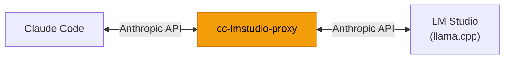

# cc-lmstudio-proxy

**Claude Code ↔ LM Studio (llama.cpp) 間の KV キャッシュ最適化プロキシ**



Claude Code をローカル LLM で動かすとき、リクエストごとに変わる billing ヘッダーや `cache_control` フィールドのせいで llama.cpp の **Prefix KV Cache が無効化**されてしまいます。cc-lmstudio-proxy はこれらのノイズを正規化し、KV キャッシュのヒット率を大幅に改善します。

## 課題

Claude Code のリクエストには、llama.cpp の Prefix KV Cache を壊す要因が 2 つあります。

### 1. `cch` 値の毎ターン変化

Claude Code はシステムプロンプトに `x-anthropic-billing-header` を埋め込み、その中の `cch` 値が毎ターン変わります。

```
cch=bb9bb → cch=bc738 → cch=c1af1 → ...
```

Prefix KV Cache は**先頭からの完全一致**が前提。システムプロンプト冒頭にあるこの可変値のせいで、会話本体がほぼ同じでもキャッシュが毎回無効になります。

### 2. `cache_control` フィールドの付与

Claude Code は Anthropic API の[プロンプトキャッシュ機能](https://docs.anthropic.com/en/docs/build-with-claude/prompt-caching)向けに、メッセージやコンテンツブロックに `cache_control` フィールドを付与します。

```json
{ "type": "text", "text": "...", "cache_control": { "type": "ephemeral" } }
```

これは Anthropic API 固有の機能であり、llama.cpp / LM Studio では意味を持ちません。しかしこのフィールドがあるとリクエスト本文が変わるため、KV キャッシュの一致判定に悪影響を与える可能性があります。

## 解決策

cc-lmstudio-proxy は Claude Code と LM Studio の間に入り、リクエストを以下のように正規化してから upstream に転送します。

| 正規化処理 | 内容 |
| --- | --- |
| `cch` 値の固定化 | システムプロンプト内の `cch=xxxxx` を `cch=00000` に統一 |
| `cache_control` の除去 | メッセージ / コンテンツブロックから `cache_control` フィールドを削除 |
| メッセージ本文の正規化 | 本文中の `cch=xxxxx` パターンも `cch=00000` に統一 |
| レスポンスの復元 | upstream からのレスポンスでは元の `cch` 値に戻して Claude Code に返却 |

ネストされたコンテンツ配列も再帰的に処理します。Claude Code 側からは透過的に動作し、通常どおり使えます。

## 効果

12 ターンのセッション（Qwen3.5-122B-A10B via LM Studio）での実測値です。今回の確認ポイントは、`cache_read_input_tokens` が 0 のまま張り付かず、会話の継続に合わせて増えていくことです。

```
 #    Dur | NewInput Create CacheRead   Out | Reuse%
-----------------------------------------------------------------
 1  46.5s |  20,960       0       0     68 |   0.0%  ← コールドスタート
 2   3.7s |  21,292       0  20,448     30 |  49.0%
 3   9.6s |  21,069       0  20,780    205 |  49.7%
 ...
10   6.3s |  53,368       0  52,728     66 |  49.7%
11   9.4s |  54,362       0  52,856     70 |  49.3%
12  61.3s |  54,502       0  53,850  1,073 |  49.7%
```

`CacheRead` が `cache_read_input_tokens` に対応し、KV キャッシュから再利用された入力トークン数を表します。2 ターン目以降は毎回 2 万〜5 万 token 台が再利用されており、Prefix KV Cache が実際に働いていることを確認できます。

`NewInput` はそのターンで新規に処理された入力トークン数、`Reuse%` は `CacheRead / (NewInput + Create + CacheRead)` です。比率は補助指標で、主眼は `CacheRead` が継続して積み上がることにあります。

| 指標 | 値 |
| --- | --- |
| 2 回目以降の `cache_read_input_tokens` | **20,448〜53,850** |
| 2 回目以降の再利用率 | **37〜50%** |
| 全体の再利用率 | **46.7%**（初回コールドスタート含む） |

> `cache_read_input_tokens` がターンを追って増えているのは、先頭のシステムプロンプトと過去メッセージが KV キャッシュから読まれているためです。一方で毎ターン末尾には新しいユーザーメッセージや最新の会話差分が追加されるため、再利用率は 100% ではなく、おおむね 40〜50% に収束します。

## 前提

- [Bun](https://bun.sh/) 1.3.10 以上

ビルドステップは不要です。TypeScript を Bun で直接実行します。

## セットアップ

```bash
# 1. 依存をインストール
bun install

# 2. 環境変数を設定
cp .env.example .env
```

`.env` の `UPSTREAM_BASE_URL` を LM Studio のアドレスに合わせます。

```dotenv
UPSTREAM_BASE_URL=http://127.0.0.1:1234
```

## 使い方

### 1. プロキシを起動

```bash
bun run start
```

### 2. Claude Code の接続先をプロキシに向ける

```bash
export ANTHROPIC_BASE_URL=http://127.0.0.1:9000
```

あとは通常どおり Claude Code を使うだけです。

### 開発

```bash
bun run dev       # watch モードで起動
bun run test      # テスト実行
bun run typecheck # 型チェック
```

## 設定

環境変数で制御します。起動時に `.env` を自動で読み込みます（シェルで `export` した値が優先）。

| 変数 | 必須 | デフォルト | 説明 |
| --- | --- | --- | --- |
| `UPSTREAM_BASE_URL` | yes | - | LM Studio の base URL（例: `http://127.0.0.1:1234`） |
| `PROXY_HOST` | no | `127.0.0.1` | プロキシの listen ホスト |
| `PROXY_PORT` | no | `9000` | プロキシの listen ポート |
| `REQUEST_TIMEOUT_MS` | no | `300000` | upstream リクエストのタイムアウト（ミリ秒） |
| `LOG_BODY_MAX_BYTES` | no | `262144` | ログに記録するリクエスト / レスポンス本文の上限バイト数 |
| `LOG_PRETTY` | no | `false` | `true` で JSON ログを整形出力 |
| `LOG_FILE` | no | - | ログの出力先ファイル。未指定時は stdout |

## ログ

cc-lmstudio-proxy はリクエスト / レスポンスの相関 ID 付き構造化ログ（JSON）を出力します。`authorization`, `x-api-key`, `cookie` などの機微ヘッダーは自動的にマスクされます。

## ライセンス

MIT
- `typescript` と `@types/bun` を dev dependency に含めているので、エディタ上でも Bun / Web API と `.ts` import の型解決が効きます。
